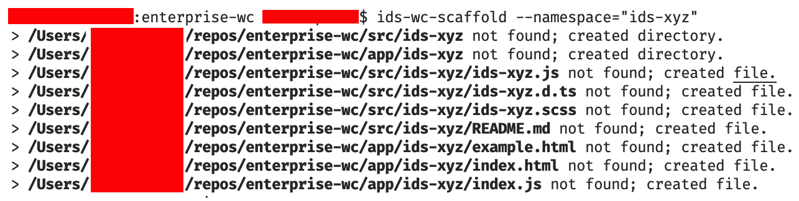

# Infor Design System WC Tools

A simple command-line tools to scaffold the boilerplate in Web Components.

## Installation

1. Git checkout this repo to a directory
2. Visit the local repo's root and in cmd/terminal:
```shell
npm i && npm link
```
3. Visit your `enterprise-wc` repo installation root in cmd/terminal and enter:
```shell
npm link ids-wc-tools
```
Now, `ids-wc-scaffold` should be available as a command to run in the project


## Usage

### `ids-wc-scaffold`

In your working directory root:

```shell
ids-wc-scaffold --namespace="ids-my-component-name"
```
Output should be similar to the following:


## How It Works

### `ids-wc-scaffold`
Generates the simply runs through `/mappings` files of a given type (e.g. `/mappings/component/*`) and:
  1. creates directories specified in `srcDirs.js` if they don't exist,
  2. creates files from `srcFiles.js` if they don't exist,
  3. replaces all instances of patterns found in files, and replaces the groups found in `replacement.js`; relies on `String.prototype.replace` so you get a standard `RegExpMatchArray` as the result in arguments to transform dynamically.

  *(note: recursive patterns for capture group will not be supported here for the principle of KISS)*


  ## TODO
  - replace template `ids-component` (+variant) strings with `{{ids-component}}` for future-proofing.
  - add `mixins` cmd param to work with entries which can use regexp group to capture/transform;  can be done with approach similar to existing `[namespace]/replacements.js`

## Notes
- mixins are already just about supported but waiting on the updated directory structure to create templates here.

- This project aims to eventually support validation but is *not meant as a code analysis tool or tokenizer* due to simple limitations of regex capture (not a substitute for proper tokenization) and time constraints;

  For certain tasks of that nature to be done effectively, we would need to either import a solution-for or build a lexer/parser for ES7 which is not pragmatic in the low priority scope of this utility set.

  Change requests are welcome but if (or before/while) introducing complexity over current behavior of just having declarations in `mappings` to manage when the app structure/patterns evolve, please keep the above in mind.